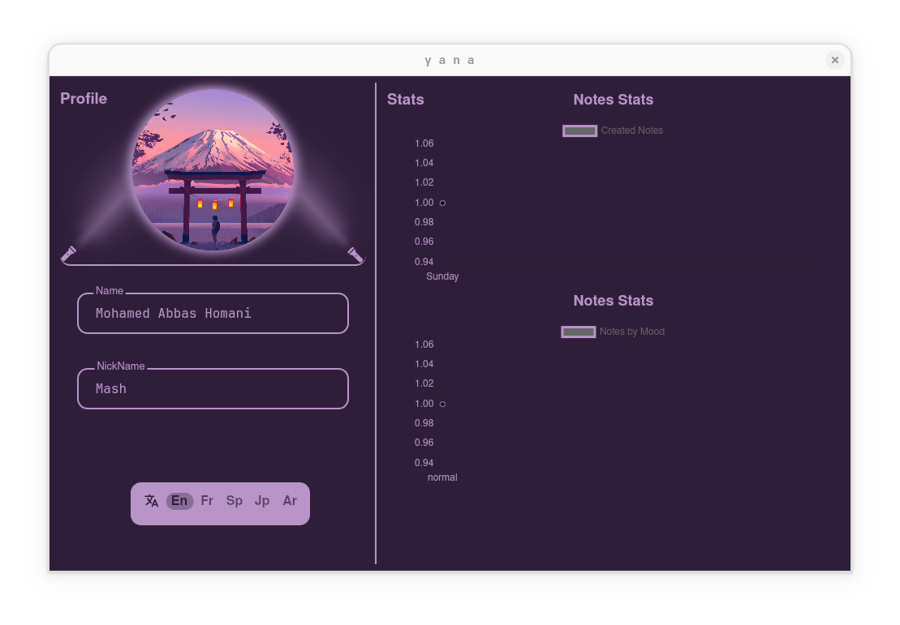
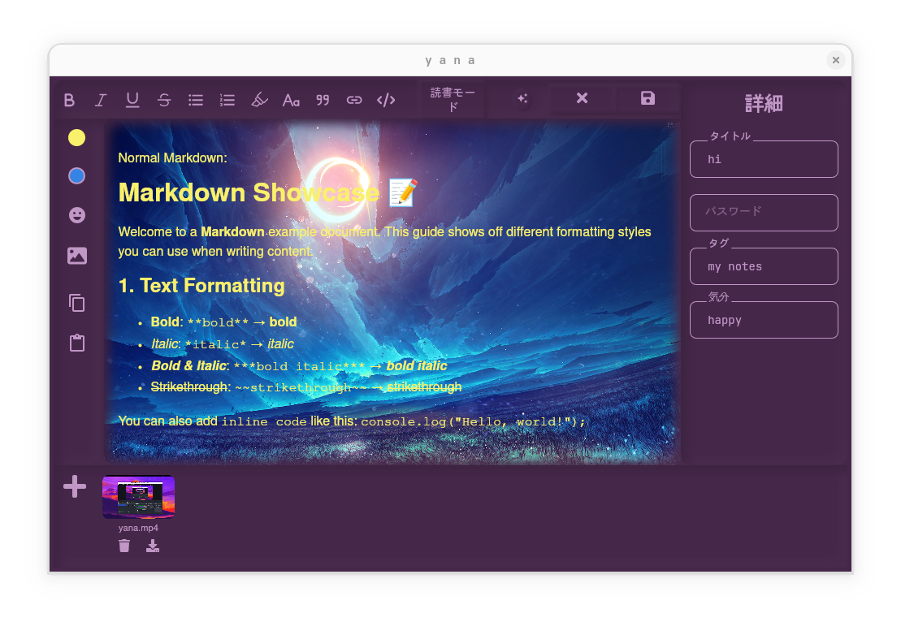
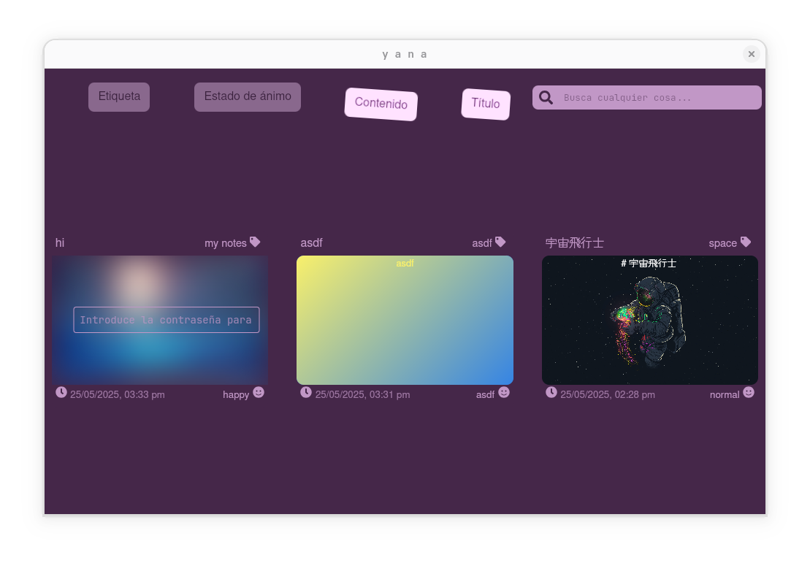
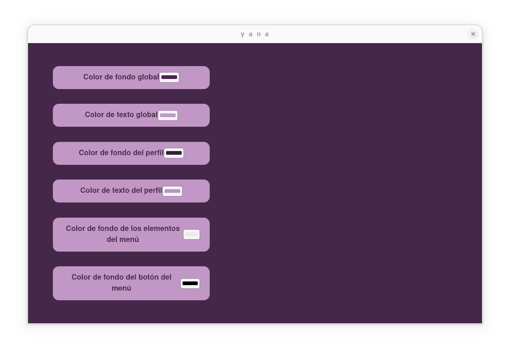

# 🌙 Yana — Yet Another Notes App

 <!-- Optional: Replace with your app logo -->

**Yana** is a fast, beautiful, and multilingual desktop notes app built with [Tauri](https://tauri.app/) using **React**, **Zustand**, and **Golang (Echo + GORM)**. It’s designed for power users and minimalists alike—whether you need to jot down quick thoughts, write in Markdown, or attach files to notes, Yana has you covered.

---

## ✨ Features

- 📝 **Markdown Support**: Write rich notes with syntax highlighting, code blocks, math, and more.
- 📎 **File Attachments**: Attach images, videos, PDFs, and other files directly to your notes.
- 📊 **Statistics Dashboard**: Get insights into your note-taking habits and trends.
- 🎨 **Custom Themes**: Choose your favorite colors to personalize your writing environment.
- 🌍 **Multilingual Support**: Available in:
  - English (`en`)
  - French (`fr`)
  - Japanese (`jp`)
  - Spanish (`sp`)
  - Arabic (`ar`)
- ⚡ **Lightweight & Fast**: Built with Tauri for a small footprint and fast performance.

---

## 🔧 Tech Stack

| Layer          | Technology                         |
| -------------- | ---------------------------------- |
| Frontend       | React + Zustand                    |
| Backend        | Golang (Echo framework + GORM)     |
| Packaging      | Tauri                              |

---

## 🎥 Demo Video

> Click the image below to watch a full walkthrough:

[](./demo/yana.mp4)

## 📸 Screenshots

| Editor View | Profile | Home | Settings |
| ----------- | ---------------- | ---------- | -------- |
|  |  |  |  |

---

---

## 🚀 Getting Started

### Prerequisites

- [Node.js](https://nodejs.org/)
- [Go](https://golang.org/)
- [Rust + Cargo](https://www.rust-lang.org/tools/install)
- [Tauri CLI](https://tauri.app/v1/guides/getting-started/prerequisites)

### Install & Run

```bash
# Install dependencies
npm install

# Run the dev server
npm run tauri dev
```

---

## 🛠 Customize

Want to tweak the theme? Go to **Settings → Theme** and pick your favorite color palette.

---

## 📂 File Structure (Simplified)

```
yana/
├── README.MD
├── backend
│   ├── go.mod
│   ├── go.sum
│   ├── handlers
│   ├── main.go
│   ├── makefile
│   ├── yana-back
│   ├── models
│   └── routes
└── frontend
    ├── README.md
    ├── dist
    ├── index.html
    ├── node_modules
    ├── package-lock.json
    ├── package.json
    ├── public
    ├── src
    ├── src-tauri
    ├── tsconfig.json
    ├── tsconfig.node.json
    └── vite.config.ts
```

---

## 📃 License

MIT License — feel free to fork, modify, and share.

---

## ❤️ Acknowledgments

- [Tauri](https://tauri.app/)
- [Echo](https://echo.labstack.com/)
- [GORM](https://gorm.io/)
- [React](https://reactjs.org/)
- [Zustand](https://github.com/pmndrs/zustand)

---

> “Take notes, in your language, in your style. With Yana.” 🌙