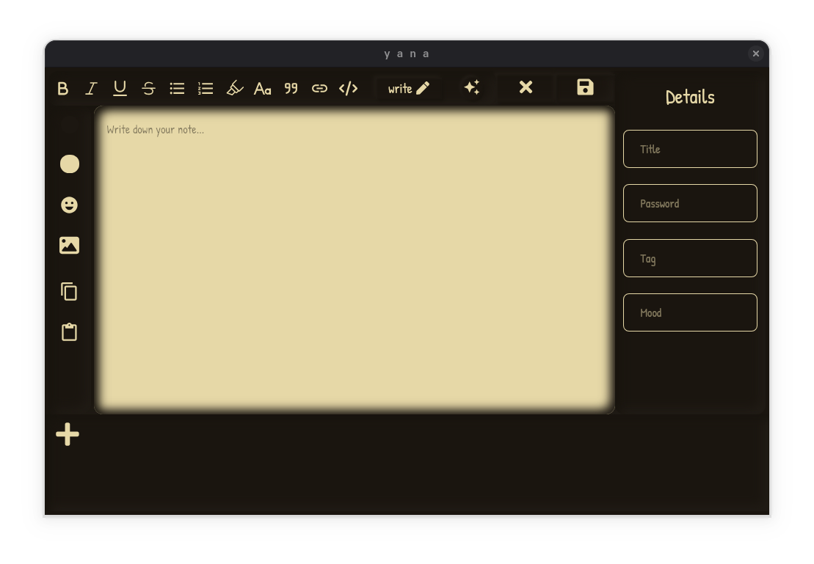
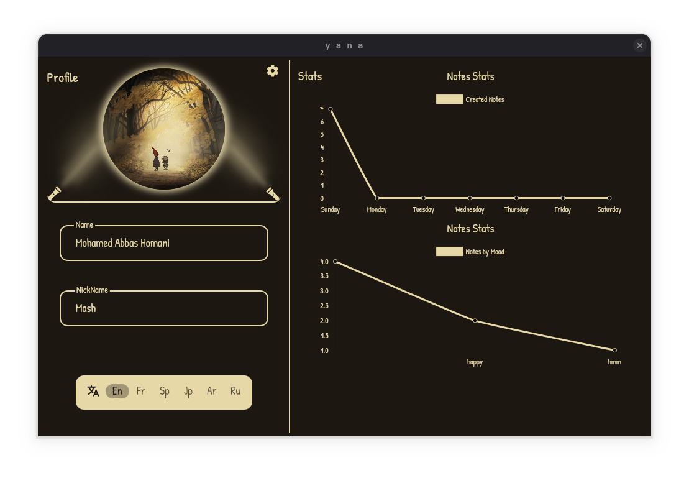
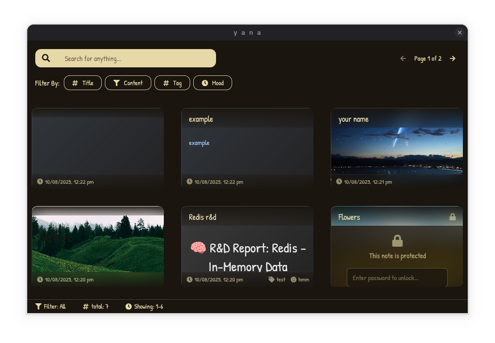
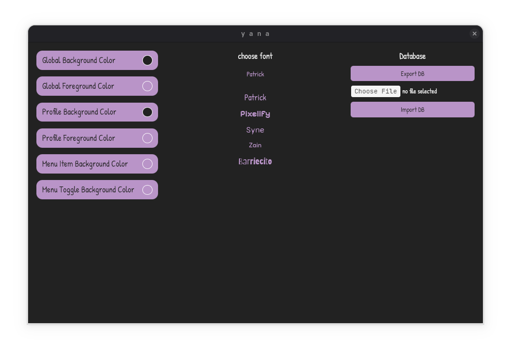
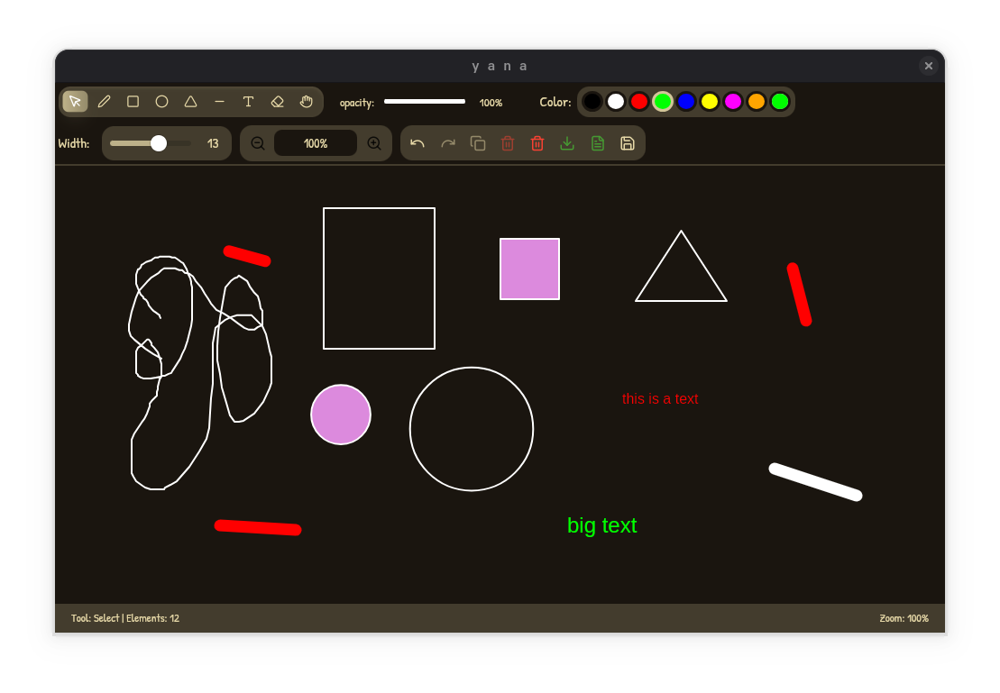
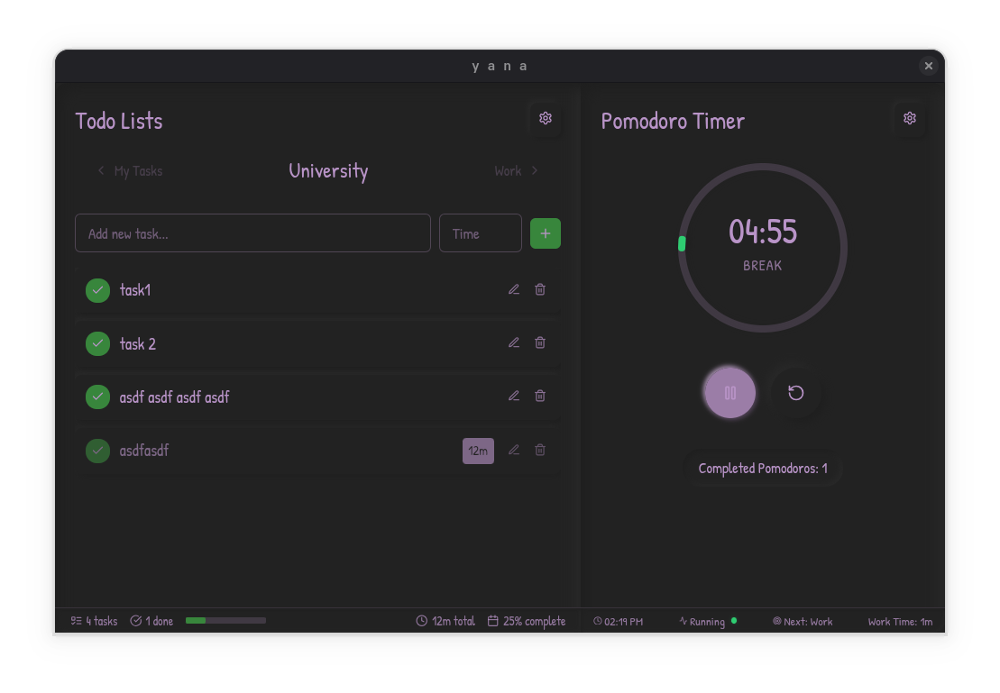

# 🌙 Yana — Yet Another Notes App

 <!-- Optional: Replace with your app logo -->

**Yana** is a fast, beautiful, and multilingual desktop notes app built with [Tauri](https://tauri.app/) using **React**, **Zustand**, and **Golang (Echo + GORM)**. It’s designed for power users and minimalists alike—whether you need to jot down quick thoughts, write in Markdown, or attach files to notes, Yana has you covered.

---

## ✨ Features

- 📝 **Markdown Support**: Write rich notes with syntax highlighting, code blocks, math, and more.
- 🖼️ **Custom Markdown Components**: Extended Markdown components including an `image` tag that supports specifying width and height (e.g. ``) and a **Gallery** component for showing multiple images cleanly.
- 🧠 **Whiteboard**: A flexible free-draw canvas for sketching ideas and export them as png or pdf.
- ⏱️ **Pomodoro + Todo List**: Built-in Pomodoro timer tightly integrated with your todo list so you can focus on tasks with sessions and short/long breaks.
- 📎 **File Attachments**: Attach images, videos, PDFs, and other files directly to your notes.
- 📤 **Export / Import Data**: Export all your notes and app data (JSON / Markdown / zip with assets) and import them back — great for backups and migrations.
- 🎨 **Multiple Fonts & Typography Options**: Choose from several curated fonts to change the look of your editor and notes (system fonts + bundled web fonts).
- 📊 **Statistics Dashboard**: Get insights into your note-taking habits, Pomodoro productivity, and session trends.
- 🎨 **Custom Themes**: Choose your favorite colors to personalize your writing environment.
- 🌍 **Multilingual Support**: Available in:
  - English (`en`)
  - French (`fr`)
  - Japanese (`jp`)
  - Spanish (`sp`)
  - Arabic (`ar`)
  - Russian (`rs`)
- ⚡ **Lightweight & Fast**: Built with Tauri for a small footprint and fast performance.

---

## 🔧 Tech Stack

| Layer          | Technology                         |
| -------------- | ---------------------------------- |
| Frontend       | React + Zustand                    |
| Backend        | Golang (Echo framework + GORM)     |
| Packaging      | Tauri                              |

---

## 📸 Screenshots

| Editor View | Profile | Home | Settings |
| ----------- | ------- | ---- | -------- |
|  |  |  |  |
|  |  |  |


---

## 🚀 Getting Started

### Prerequisites

- [Node.js](https://nodejs.org/)
- [Go](https://golang.org/)
- [Rust + Cargo](https://www.rust-lang.org/tools/install)
- [Tauri CLI](https://tauri.app/v1/guides/getting-started/prerequisites)

### Install & Run

```bash
# Install dependencies
npm install

# Run the dev server
npm run tauri dev
```
> “Take notes, in your language, in your style. With Yana.” 🌙